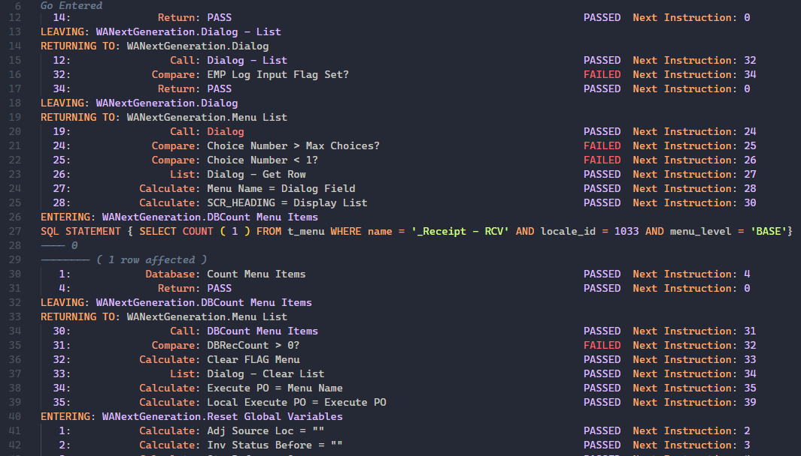
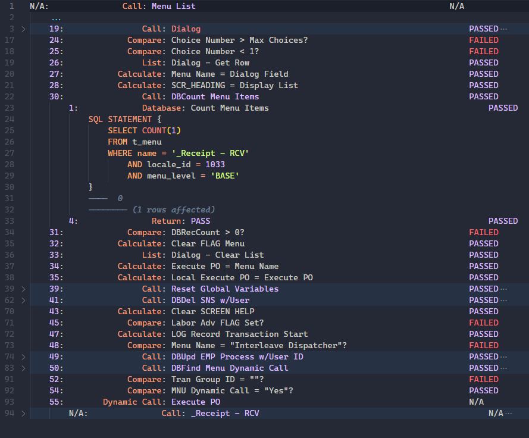
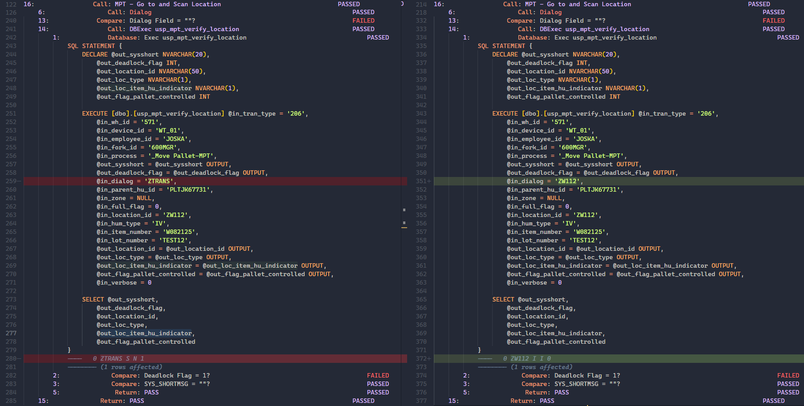

# Architect Debug Log

This is the architect-debug-lang syntax-highlighting and formatting language extension.

## Install

Go to the Releases page and download the `.vsix` extension file there. Then, inside VSCode, open the command pallette with `Ctrl+Shift+p` and select file `.vsix` file that just downloaded. It should prompt you to reload to enable.

## Features

To enable on an opened Architect Debug log file, open the command pallette with `Ctrl+Shift+p` and select `Change Language Mode` (the shortcut for this is `Ctrl+k m`), then search for and select `Architect (architect)`.

Alternatively, name the file with a `.archlog` file extension, and the extension should automatically change to `Architect` language mode.

### Syntax Highlighting

This extension provides syntax highlighting through a TextMate grammar for Architect Debug Message Log text. Embedded SQL inside `SQL STATEMENT` braces is also syntax highlighted.



### Formatting

This extension also provides formatting of Architect Debug Message Log text into properly indented and nested statements. This is very useful for understanding the execution of a process because it shows the structure of the process's execution.



To format, open the command pallette with `Ctrl+Shift+p` and search for and select `Format Document`. Alternatively, use the default shortcut `Shift+Alt+f`.

After formatting, the document will show completely unfolded, so I like to use the command `Fold All` to show what the top-level execution looks like. It helps to know VSCode's default folding shortcuts.

| Command | Default Shortcut |
| ---- | ---- |
| Fold All | `Ctrl+k Ctrl+0` |
| Unfold All | `Ctrl+k Ctrl+j` |
| Fold Recursively | `Ctrl+k Ctrl+[` |
| Unfold Recursively | `Ctrl+k Ctrl+]` |
| Fold | `Ctrl+Shift+[` |
| Unfold | `Ctrl+Shift+]` |
| Fold All Except Selected | `Ctrl+k Ctrl+-` |
| Toggle Fold | `Ctrl+k Ctrl+l` |

But you can always just click the folding arrows to the right of VSCode's line numbers.

#### Diffing

The other useful thing this enables is diffing different parts of the log. For example, I was trying to see the differences in execution between two runs of the same process object (one was working, the other was not). Using the formatted debug log with a diffing tool like [Partial Diff](https://marketplace.visualstudio.com/items?itemName=ryu1kn.partial-diff) let me see the differences between the two parts of the log which helped me troubleshoot the issue pretty quickly.



## Build

```sh
npm install
vsce package
```

## Bugs

- [X] It will fail parsing if there's a closing curly brace inside SQL statement (happens for JSON strings)
- [X] End action
	- Example: `   22:                 End: N/A                                                          PASSED  Next Instruction: 0`
- [X] `SQL STATEMENT {BEGIN TRANSACTION}` failed parse b/c rn I require spaces between curly braces
- [X] the following line causs parse fail: `Value = [IV]`. Occurs when you set a field manually in debugger
- [X] "Line numbers" inside names pick up syntax highlighting. Change syntax grammar.
	- Example: `... Calculate: ScrOpt: F2:Item ...`
- [X] Here's a sticky one that comes up in `demo/more-ops.archlog`. The last call to `_Directed Move - DMR` is a dynamic call, but it's at the end and never finishes in the log, so it doesn't have a `... Dynamic Call: Execute PO ...` line. So, b/c of the way Architect debug log works, if you go up from the bottom of the log you'll find an `ENTERING WANextGeneration._Directed Move - DMR` line, but you won't be able to tell that it got there from a `Dynamic Call: Execute PO` call. So the formatter just wraps up all the lines from the bottom up to the ENTERING line, and calls that a `... Call: _Directed Move - DMR ...` line with nested lines, rather than a dynamic call followed by a call.
	- The common issue here would be for calling a business process object from the main menu, so maybe you could hard code it where if the ENTERING line is preceded by the `Compare: MNU Dynamic Call = "Yes"?` line, then you should be OK to assume that it's a dynamic call. 
- [ ] **Known Limitation**: I get rid of application information for calls. I might need to add this back

## TODO

- [X] Bundle with webpack
- [X] Dynamic Call statement will nest until Entering, but then it doesn't show what PO it Executed. It just says `Dynamic Call: Execute PO`, instead of `Dynamic Call: _Directed Move - DMR` - see `demo/all-ops.archlog` for example.
- [X] In top level, use RETURNING TO statements to infer top level call. For example, if debugging is started inside a busines process object, it'll keep RETURNING TO: <app>.<bpo>. And you can find that in the top level statement list. So then that should be used to create a Call: <bpo> statement with unknown result:
	- ` N/A:                Call: <bpo>                       N/A
	- and then inside is the rest. So you use all the contextual information you can.
- [ ] Split SQL result rows into multiple rows. This would allow to more easily see what was SELECT'ed by the SQL STATEMENT database action.
	- complication is that rn they're space delimited, but the values themselves can include spaces. JSON will surround with double quotes which could be worked around, but it's also possible that `---- THIS IS A SINGLE ERROR MESSAGE` could be a valid output.